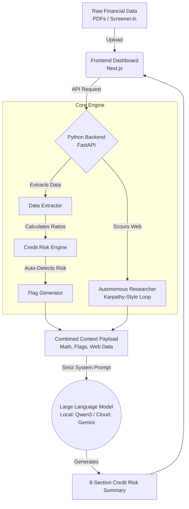
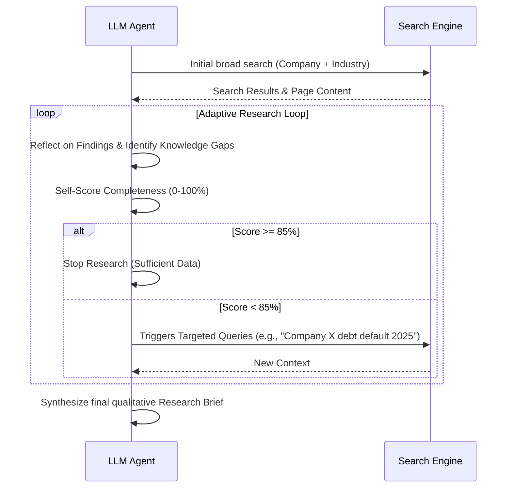

# CreditGuard AI 🏦🛡️

**CreditGuard AI** is an intelligent, automated credit risk analysis platform designed for commercial banks and lending institutions. It takes raw financial data (documents, PDFs, or Screener data), computes complex financial ratios, automatically scouts the web for qualitative risk signals, and generates a formal, decision-grade **Credit Risk Summary**. 

Instead of analysts spending hours hunting through annual reports and calculating metrics, CreditGuard AI does the heavy lifting in seconds, freeing up human experts to make the final lending decisions.

---

## 🌟 What Does It Do?

1. **Extract & Validate:** Reads financial statements, validates data sufficiency (ensuring at least 3 years of history), and extracts Revenue, EBITDA, Debt, and Cash Flow metrics.
2. **Compute & Screen:** Automatically calculates key ratios (DSCR, Debt/Equity, Interest Coverage) and auto-flags potential risks (e.g., profits not backed by operating cash flows, surging debt).
3. **Autonomous Web Research:** An autonomous AI agent searches the web for qualitative context—promoter pledging, rating downgrades, court cases, and industry headwinds.
4. **LLM-Driven Risk Summary:** An AI model (like Qwen3 or Gemini) synthesizes all pre-computed math and web research into a strict, 8-section Credit Appraisal Memorandum (CAM).

---

## 🏗️ How It Works (Architecture Overview)

CreditGuard AI separates the **deterministic math** from the **creative reasoning**. 

*   **Python Engine:** Handles the extraction, validation, arithmetic, and red-flag logic. Neural networks are bad at math, so Python does it.
*   **LLM Engine:** Takes the pre-computed facts, interprets the trends, weighs the risks, and articulates the final risk judgment.



### The Autonomous Researcher Workflow

We use an adaptive "Karpathy-style" research loop. The AI does not just do a single search; it reflects on what it found, scores its own knowledge, and keeps searching until it understands the complete picture.



---

## 🛠️ Technology Stack

### Frontend
*   **Framework:** Next.js 16 (App Router)
*   **Styling:** Tailwind CSS (utility-first, responsive design)
*   **Icons:** Lucide React

### Backend
*   **Framework:** FastAPI (Python)
*   **Local AI Inference:** Ollama 
*   **Cloud AI Fallback:** Google Gemini API
*   **Web Searching:** DuckDuckGo API hookups 

---

## 🚀 Getting Started

### Prerequisites

*   Node.js & npm
*   Python 3.10+
*   [Ollama](https://ollama.com/) (if running models locally)

### 1. Start the Python Backend Service

The backend handles all heavy lifting, including data calculation and LLM inference.

```bash
# Navigate to the backend directory
cd python-service

# Create and activate a virtual environment
python -m venv venv
source venv/bin/activate  # On Windows use `venv\Scripts\activate`

# Install dependencies
pip install -r requirements.txt

# Start the FastAPI server
uvicorn main:app --host 0.0.0.0 --port 8000 --reload
```

### 2. Start the Next.js Frontend

The Next.js app powers the beautiful, modern dashboard where you assess borrowers.

```bash
# In the root folder of the project
npm install

# Start the dev server
npm run dev
```

Open [http://localhost:3000](http://localhost:3000) in your browser. 

---

## 📝 The 8-Section Output

CreditGuard AI is strictly instructed to produce clean, factual reports divided perfectly into these sections:
1.  **Borrower Overview**
2.  **Financial Analysis**
3.  **Liquidity & Cash Flow Assessment**
4.  **Key Risk Drivers**
5.  **Mitigating Factors**
6.  **Red Flags**
7.  **Overall Risk Assessment** (LOW / MODERATE / HIGH)
8.  **Confidence Level** (Based on data availability)

*Built by Gaurav Mahale as part of an advanced AI generation project.*
